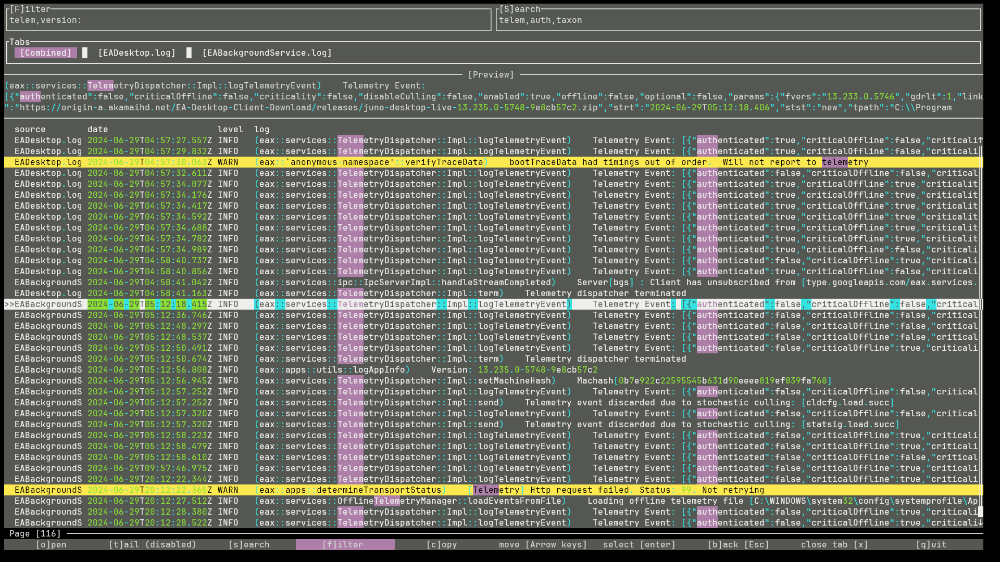

# Log Viewer RS

A log viewer with terminal UI.



## Build
Install rustup and run:
```sh
cargo run --release
```

## Supported platforms

Only Windows is tested, but this project is expected to work on other platforms with zero to minimal effort.

## Features
- Filtering log entires by keyword
- Searching log entries by keyword + highlighting matches
- Viewing entries combined from multiple log files ordered by log date

## Supported log formats
Currently the following formats are supported, but more formats can be added per request:
- Windows (MSI) installer logs
- CEF logs
- Multiple log formats from game launchers on Windows (e.g., Steam)
